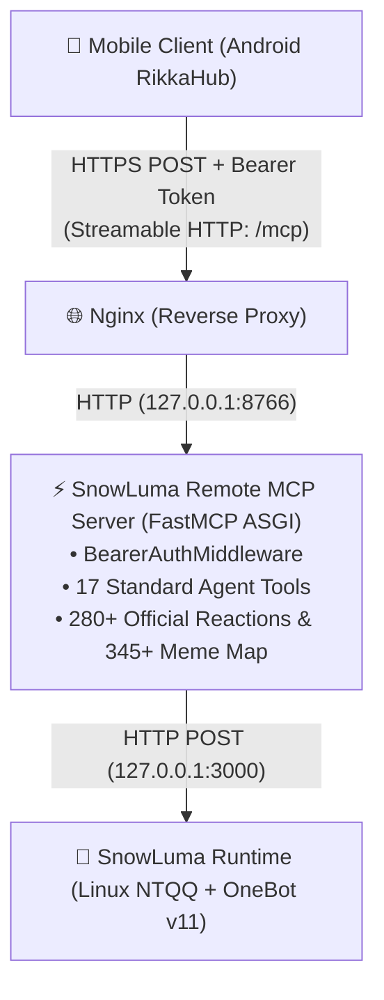

<p align="right">
  <strong>Language:</strong>
  <b>English</b> |
  <a href="README_zh.md">简体中文</a>
</p>

<div align="center">

# SnowLuma Remote MCP Server

[](README.md)
[](README_zh.md)

<br/>

[](LICENSE)
[](https://www.python.org/)
[](https://modelcontextprotocol.io)
[](https://github.com/SnowLuma/SnowLuma)

<p align="center">
  <strong>Next-Gen Remote MCP (Streamable HTTP / SSE) Gateway for SnowLuma OneBot v11.</strong><br/>
  Native Claude MCP Server crafted for Android <a href="https://github.com/rikkahub/rikkahub">RikkaHub</a> & Remote AI Agents.
</p>

</div>

---

## 💡 Why This Project?

The official and community MCP solutions for [SnowLuma](https://github.com/SnowLuma/SnowLuma) (such as `@snowluma/mcp`) primarily target desktop environments (Claude Desktop, Cline, DSH) using **local `stdio` process pipes**.

However, when running AI agents on mobile devices (e.g. **RikkaHub on Android**) or remote cloud containers, clients cannot spawn local processes inside your server. They require a **Remote MCP endpoint (Streamable HTTP / SSE)** over public HTTPS.

Instead of wrapping bloated subprocess gateways like `supergateway` (which suffer from process stalls, high memory consumption, and zombie pipes during mobile network switches), **SnowLuma Remote MCP** provides an ultra-lightweight, native **Python + FastMCP** server.

### Key Highlights
- 🚀 **Native Remote Architecture**: Pure asynchronous ASGI service, zero subprocess wrappers, zero pipe stalls.
- 🪶 **Extremely Lightweight**: Built on Python 3.12 + official `mcp` SDK; resident memory is only **~15 MB** (vs 100MB+ for Node.js suites).
- 💬 **Tailored for AI Agents**: Flat, intuitive tooling for messaging, history retrieval, group management, and quotation replies.
- ✨ **Full 280+ QQ System Reaction Support**: Built-in 345+ popular Chinese aliases & network memes directly mapped to Linux NTQQ official Reaction IDs, plus full integer ID passthrough.
- 🛡️ **Hardened Production Security**: Bearer Token authentication, DNS-rebinding protection bypass for reverse proxies, and single-port HTTPS multiplexing.
- ⚡ **Universal OneBot Pass-through**: Includes `call_onebot_action` to access all 170+ native OneBot v11 actions without writing extra code.

---

## 🏗️ Architecture



---

## 🛠️ Tool Catalog (17 Tools)

### 1. Messaging & Interaction
| Tool | Description | Highlights |
|---|---|---|
| `send_group_msg` | Send group message | Supports `at_user_id` parameter and `reply_to_message_id` |
| `send_private_msg` | Send private message | Supports plain text and CQ codes |
| `send_msg` | Universal message sender | Unified interface for both group and private |
| `delete_msg` | Recall message | Recalls a message within timeout |
| `get_msg` | Get message detail | Retrieves sender and raw content by message ID |
| `get_group_msg_history` | Read recent group history | Strips redundant fields to save LLM tokens |
| `set_msg_emoji_like` | Set message Reaction | Supports 345+ Chinese names (e.g. `点赞`, `狗头`, `菜狗`, `尊嘟假嘟`) & 280+ numeric IDs |
| `list_supported_emojis` | List reaction emojis | Returns categorized lists and full dictionary with 345+ mappings |

### 2. Group & Profile Management
| Tool | Description | Highlights |
|---|---|---|
| `get_login_info` | Get bot QQ number and nickname | Retrieves logged-in account info |
| `get_status` | Get SnowLuma service status | Returns connection health and online status |
| `get_friend_list` | List all friends | Retrieves friend account list |
| `get_group_list` | List all joined groups | Returns group IDs, names, and capacity |
| `get_group_info` | Get group details | Supports `group_id` and optional `no_cache` |
| `get_group_member_list` | Get complete group member list | Returns full member details |
| `set_group_ban` | Mute/unmute group member | Duration in seconds (0 = unmute) |
| `set_group_card` | Change member group nickname | Sets custom group card |
| `set_group_kick` | Kick member from group | Optional `reject_add_request` |

### 3. Escape Hatch
| Tool | Description | Highlights |
|---|---|---|
| `call_onebot_action` | Universal OneBot pass-through | Direct access to all 170+ OneBot v11 actions |

---

## 🚀 Quick Start

### 1. Clone & Install
```bash
git clone https://github.com/MorphieEndless/snowluma-remote-mcp.git
cd snowluma-remote-mcp

# Create virtual environment
python3 -m venv venv
source venv/bin/activate

# Install dependencies
pip install -r requirements.txt
```

### 2. Configure Environment
```bash
cp .env.example .env
```
Edit `.env`:
```env
MCP_HOST=127.0.0.1
MCP_PORT=8766
MCP_AUTH_TOKEN=generate_a_secure_token_here

SNOWLUMA_API_BASE=http://127.0.0.1:3000
SNOWLUMA_API_TOKEN=your_snowluma_onebot_token_here
SNOWLUMA_TIMEOUT=30.0
```

### 3. Run
```bash
python server.py
```
Health check:
```bash
curl http://127.0.0.1:8766/health
```

---

## 🌐 Production Deployment

### Systemd Daemon
```bash
sudo cp systemd/snowluma-mcp.service /etc/systemd/system/
sudo systemctl daemon-reload
sudo systemctl enable --now snowluma-mcp.service
```

### Nginx Reverse Proxy
Add the following locations into your HTTPS `server` block:
```nginx
# Remote MCP Endpoint
location /mcp {
    proxy_pass http://127.0.0.1:8766/mcp;
    proxy_http_version 1.1;
    proxy_set_header Host $host;
    proxy_set_header X-Real-IP $remote_addr;
    proxy_set_header X-Forwarded-For $proxy_add_x_forwarded_for;
    proxy_set_header X-Forwarded-Proto $scheme;

    # Disable buffering for streamable transport
    proxy_buffering off;
    proxy_cache off;
    chunked_transfer_encoding on;
    proxy_read_timeout 3600s;
    proxy_send_timeout 3600s;
}

# Health Probe (Exempt from auth)
location /mcp-health {
    proxy_pass http://127.0.0.1:8766/health;
    proxy_http_version 1.1;
    proxy_set_header Host $host;
    proxy_set_header X-Real-IP $remote_addr;
    proxy_set_header X-Forwarded-For $proxy_add_x_forwarded_for;
    proxy_set_header X-Forwarded-Proto $scheme;
}
```

---

## 📱 Connecting with RikkaHub (Android)

In [RikkaHub](https://github.com/rikkahub/rikkahub):
1. Navigate to **Settings → MCP → Add (+)**
2. Select **Streamable HTTP** protocol
3. Fill in:
   - **Name**: `SnowLuma`
   - **URL**: `https://your-domain.com/mcp`
   - **Authorization**: `Bearer <your_MCP_AUTH_TOKEN>`
4. Save and verify that your tools appear in your Agent's tool palette!

---

## 🎭 Reaction Emojis Cheat Sheet (280+ Supported)

When calling `set_msg_emoji_like`, you can pass either the **Chinese Name**, **Meme Alias**, or the **Numeric ID**:

### Categorized Popular Picks
- **Approval & Praise (认同赞美)**:
  - `点赞` / `赞` (`76`), `超级赞` (`364`), `666` (`356`), `强` (`76`), `OK` / `好的` (`124`), `收到` (`428`), `鼓掌` (`99`), `崇拜` (`318`)
- **Affection & Warmth (喜爱亲昵)**:
  - `贴贴` / `蹭蹭` (`350`), `比心` (`319`), `爱心` / `红心` (`66`), `抱抱` (`49`), `亲亲` (`109`), `蹭一蹭` (`242`), `么么哒` (`410`)
- **Fun & Memes (幽默搞怪)**:
  - `狗头` / `汪汪` (`277`), `菜狗` / `菜汪` (`317`), `打call` (`311`), `摸鱼` (`285`), `尊嘟假嘟` (`354`), `喵喵` (`307`), `摇起来` (`413`)
- **Shock & Banter (震惊吐槽)**:
  - `吃瓜` (`271`), `问号脸` / `疑惑` (`268`), `托腮` (`212`), `辣眼睛` (`265`), `不是吧` (`476`), `给你一拳` (`474`), `裂开` (`357`), `大怨种` (`344`)
- **Mood & Empathy (情绪状态)**:
  - `笑哭` (`182`), `坏笑` (`101`), `微笑` (`14`), `大哭` (`9`), `流泪` (`5`), `委屈` (`106`), `捂脸` (`264`), `emo` (`382`), `头秃` (`267`)

*(Call `list_supported_emojis` tool at any time to get the complete dictionary of all 345+ aliases and 280+ system IDs).*

---

## 📄 License

Distributed under the [MIT License](LICENSE).
