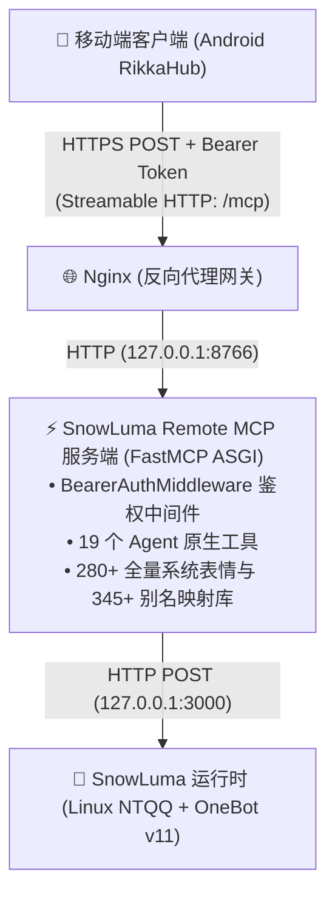

<p align="right">
  <strong>语言 / Language:</strong>
  <a href="README.md">English</a> |
  <b>简体中文</b>
</p>

<div align="center">

# SnowLuma Remote MCP 网关

[](README.md)
[](README_zh.md)

<br/>

[](LICENSE)
[](https://www.python.org/)
[](https://modelcontextprotocol.io)
[](https://github.com/SnowLuma/SnowLuma)

<p align="center">
  <strong>专为 Android <a href="https://github.com/rikkahub/rikkahub">RikkaHub</a> 与远程 AI Agent 打造的下一代 SnowLuma OneBot v11 原生 Remote MCP (Streamable HTTP / SSE) 网关。</strong>
</p>

</div>

---

## 💡 为什么需要本项目？

目前社区与官方为 [SnowLuma](https://github.com/SnowLuma/SnowLuma) 提供的 MCP 适配方案（例如 `@snowluma/mcp`）主要面向桌面环境（Claude Desktop、Cline、DSH），底层基于**本地子进程 `stdio` 管道**通信。

然而，在移动端（例如安卓手机上的 **RikkaHub**）或分布式云端 Agent 场景中，客户端无法在你的服务器宿主机上拉起本地进程。它们需要的是一个**基于公网 HTTPS 的原生远程端点（Remote MCP：Streamable HTTP / SSE）**。

如果使用 `supergateway` 等通用子进程转 HTTP 包装层，在移动网络切换与高并发下极易发生管道僵死、进程卡死与异常高内存占用（Node.js 运行时动辄占用 100MB+）。

**SnowLuma Remote MCP** 采用原生 **Python + FastMCP** 架构重构，彻底移除了子进程管道层：
- 🚀 **原生远程架构**：纯异步 ASGI 网络服务，无子进程拉起，杜绝管道僵死与进程泄露。
- 🪶 **极致轻量高效**：基于 Python 3.12 + 官方 MCP SDK 构建，常驻内存仅约 **15 MB**。
- 💬 **为 AI Agent 量身定制**：精心封装了发送消息、拉取精简历史、@群友、引用回复、合并转发智能解析与群管理等 19 个扁平化高频工具。
- ✨ **独家全量 280+ 贴表情反应（Reaction）**：内置 345+ 常见中文别名与网络热梗（如 `尊嘟假嘟`、`给你一拳`、`菜狗`、`狗头`、`摸鱼`、`打call` 等），直通 Linux NTQQ 官方 Reaction 库，支持整数 ID 自由透传。
- 🛡️ **生产级安全防护**：内置 Bearer Token 强校验中间件、反向代理穿透与防 DNS 重绑定白名单放行。
- ⚡ **全能 OneBot 透传**：提供 `call_onebot_action` 万能接口，直接透传调用底层 170+ 个 OneBot v11 原生动作。

---

## 🏗️ 系统架构图



---

## 🛠️ 工具矩阵（19 个原生工具）

### 1. 消息收发与轻量互动
| 工具名称 | 功能说明 | 参数与核心亮点 |
|---|---|---|
| `send_group_msg` | 发送群聊消息 | 原生支持 `at_user_id`（自动@群友）与 `reply_to_message_id`（引用回复） |
| `send_private_msg` | 发送私聊消息 | 支持纯文本与 OneBot CQ 码 |
| `send_msg` | 通用消息发送 | 统一收敛群聊与私聊参数，便于大模型自主分支路由 |
| `delete_msg` | 撤回消息 | 支持撤回机器人自己发送或具备管理权限的消息 |
| `get_msg` | 获取单条消息详情 | 根据消息 ID 解析发送者与消息原文 |
| `get_group_msg_history` | 获取群历史记录 | 自动剔除冗余字段，智能提取合并转发 ID，大幅缩减 LLM 上下文 Token 开销 |
| `get_friend_msg_history` | 获取私聊历史记录 | 自动剔除冗余协议字段，智能提取合并转发 ID，支持向前翻页查询 |
| `get_forward_msg` | 智能解析合并转发 | 将底层几十 KB 臃肿的 OneBot AST 清洗转换为高信噪比 Markdown 剧本（Token 缩减 95%），模型开箱即读 |
| `set_msg_emoji_like` | 贴表情反应 (Reaction) | 支持 345+ 中文名/热梗（如 `点赞`, `狗头`, `菜狗`, `尊嘟假嘟`）及 280+ 官方数字 ID |
| `list_supported_emojis` | 列出可用反应表情 | 返回分类推荐表情列表与完整的 345+ 映射字典 |

### 2. 群管与社交关系
| 工具名称 | 功能说明 | 参数与核心亮点 |
|---|---|---|
| `get_login_info` | 获取当前机器人登录信息 | 返回当前机器人的 QQ 号与昵称 |
| `get_status` | 获取服务运行状态 | 返回 SnowLuma 在线状态与连接健康度 |
| `get_friend_list` | 获取好友列表 | 返回机器人已添加的好友账号及昵称 |
| `get_group_list` | 获取已加入群聊列表 | 返回群号、群名及成员上限 |
| `get_group_info` | 获取群详细资料 | 支持 `group_id`、可选 `no_cache` |
| `get_group_member_list` | 获取群完整成员列表 | 支持按群拉取全体成员详细信息 |
| `set_group_ban` | 禁言群成员 | 支持 `user_id` 与 `duration`（秒数，0 为解除禁言） |
| `set_group_card` | 修改群名片 | 支持修改指定成员的名片（群昵称） |
| `set_group_kick` | 将成员移出群聊 | 支持 `reject_add_request`（拒绝再次加群） |

### 3. 全能透传兜底
| 工具名称 | 功能说明 | 参数与核心亮点 |
|---|---|---|
| `call_onebot_action` | OneBot 原生动作透传 | 支持直接透传调用底层 170+ 个 OneBot v11 原生动作 |

---

## 🚀 快速上手

### 1. 克隆与安装依赖
```bash
git clone https://github.com/MorphieEndless/snowluma-remote-mcp.git
cd snowluma-remote-mcp

# 创建虚拟环境
python3 -m venv venv
source venv/bin/activate

# 安装生产依赖
pip install -r requirements.txt
```

### 2. 环境变量配置
```bash
cp .env.example .env
```
编辑 `.env` 文件：
```env
MCP_HOST=127.0.0.1
MCP_PORT=8766
MCP_AUTH_TOKEN=在此设置你的安全随机鉴权密钥

SNOWLUMA_API_BASE=http://127.0.0.1:3000
SNOWLUMA_API_TOKEN=在此填写你的SnowLuma_OneBot_HTTP_Token
SNOWLUMA_TIMEOUT=30.0
```

### 3. 运行测试
```bash
python server.py
```
健康探活检查：
```bash
curl http://127.0.0.1:8766/health
```

---

## 🌐 生产环境部署

### 1. Systemd 守护进程
```bash
sudo cp systemd/snowluma-mcp.service /etc/systemd/system/
sudo systemctl daemon-reload
sudo systemctl enable --now snowluma-mcp.service
```

### 2. Nginx 反向代理
在你的 HTTPS `server` 块中加入以下配置（关闭代理缓冲以支持 Streamable HTTP 协议）：
```nginx
# Remote MCP 端点
location /mcp {
    proxy_pass http://127.0.0.1:8766/mcp;
    proxy_http_version 1.1;
    proxy_set_header Host $host;
    proxy_set_header X-Real-IP $remote_addr;
    proxy_set_header X-Forwarded-For $proxy_add_x_forwarded_for;
    proxy_set_header X-Forwarded-Proto $scheme;

    # 禁用缓冲，保证长连接流式传输实时性
    proxy_buffering off;
    proxy_cache off;
    chunked_transfer_encoding on;
    proxy_read_timeout 3600s;
    proxy_send_timeout 3600s;
}

# 免鉴权健康探活端点
location /mcp-health {
    proxy_pass http://127.0.0.1:8766/health;
    proxy_http_version 1.1;
    proxy_set_header Host $host;
    proxy_set_header X-Real-IP $remote_addr;
    proxy_set_header X-Forwarded-For $proxy_add_x_forwarded_for;
    proxy_set_header X-Forwarded-Proto $scheme;
}
```

---

## 📱 安卓端 RikkaHub 接入指引

在安卓端 [RikkaHub](https://github.com/rikkahub/rikkahub) 中：
1. 打开 **设置 → MCP → 添加 (+)**；
2. 协议类型选择 **Streamable HTTP**；
3. 填入连接信息：
   - **名称**：`SnowLuma`
   - **URL**：`https://你的公网域名.com/mcp`
   - **Authorization**：`Bearer <你的_MCP_AUTH_TOKEN>`
4. 保存后，进入 Agent 聊天界面，即可在工具托盘中看到 19 个全新工具！

---

## 🎭 反应表情（Reaction）速查对照表（已支持 280+ 全量系统表情）

调用 `set_msg_emoji_like` 工具时，你可以直接传入**中文名称**、**流行热梗**或**数字 ID**：

### 分类高频推荐
- **认同赞美**：
  - `点赞` / `赞` (`76`), `超级赞` (`364`), `666` (`356`), `强` (`76`), `OK` / `好的` (`124`), `收到` (`428`), `鼓掌` (`99`), `崇拜` (`318`)
- **喜爱亲昵**：
  - `贴贴` / `蹭蹭` (`350`), `比心` (`319`), `爱心` / `红心` (`66`), `抱抱` (`49`), `亲亲` (`109`), `蹭一蹭` (`242`), `么么哒` (`410`)
- **幽默搞怪**：
  - `狗头` / `汪汪` (`277`), `菜狗` / `菜汪` (`317`), `打call` (`311`), `摸鱼` (`285`), `尊嘟假嘟` (`354`), `喵喵` (`307`), `摇起来` (`413`)
- **震惊吐槽**：
  - `吃瓜` (`271`), `问号脸` / `疑惑` (`268`), `托腮` (`212`), `辣眼睛` (`265`), `不是吧` (`476`), `给你一拳` (`474`), `裂开` (`357`), `大怨种` (`344`)
- **情绪状态**：
  - `笑哭` (`182`), `坏笑` (`101`), `微笑` (`14`), `大哭` (`9`), `流泪` (`5`), `委屈` (`106`), `捂脸` (`264`), `emo` (`382`), `头秃` (`267`)

*(可随时调用 `list_supported_emojis` 工具查询完整的 345+ 别名映射与 280+ 系统 ID 列表)*。

---

## 📄 开源协议

本项目基于 [MIT License](LICENSE) 开源发布。
